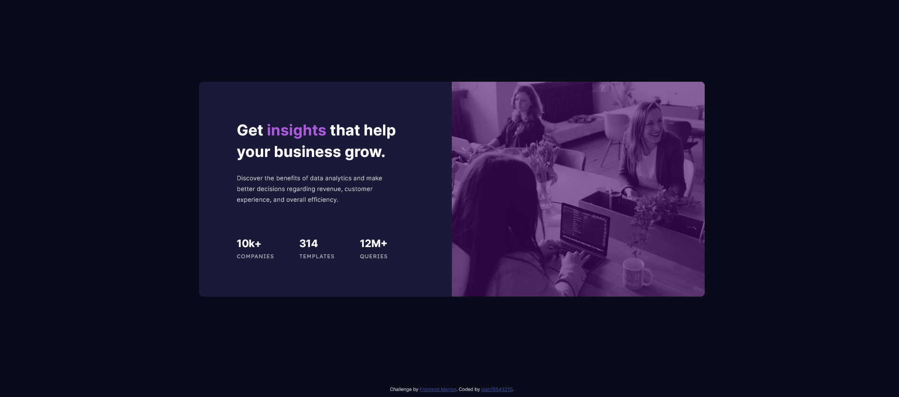

# Frontend Mentor - Stats preview card component solution

This is a solution to the [Stats preview card component challenge on Frontend Mentor](https://www.frontendmentor.io/challenges/stats-preview-card-component-8JqbgoU62). Frontend Mentor challenges help you improve your coding skills by building realistic projects.

## Table of contents

- [Overview](#overview)
  - [The challenge](#the-challenge)
  - [Screenshot](#screenshot)
  - [Links](#links)
- [My process](#my-process)
  - [Built with](#built-with)
  - [What I learned](#what-i-learned)
- [Author](#author)

## Overview

### The challenge

Users should be able to:

- View the optimal layout depending on their device's screen size

### Screenshot



### Links

- Solution URL: [https://www.frontendmentor.io/solutions/stats-preview-card-component--po3RCnkHv](https://www.frontendmentor.io/solutions/stats-preview-card-component--po3RCnkHv)
- Live Site URL: [https://josh76543210-fm-stats-preview-card.netlify.app/](https://josh76543210-fm-stats-preview-card.netlify.app/)

## My process

### Built with

- HTML
- CSS

### What I learned

- Use css to create a colored image overlay

```css
.card-img {
  background-image: linear-gradient(
      rgba(66, 9, 102, 0.6),
      rgba(66, 9, 102, 0.6)
    ), url("images/image-header-desktop.jpg");
  background-size: cover;
  background-position: center;
  background-repeat: no-repeat;
}
```

## Author

- Frontend Mentor - [@josh76543210](https://www.frontendmentor.io/profile/josh76543210)
- Twitter - [@josh76543210](https://www.twitter.com/josh76543210)
